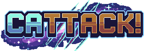

# 🐾 Cattack!

**A cat-collecting space adventure built for Reddit.**

The galaxy is crawling with mysterious cats—and they all belong in your collection. Explore hostile worlds, survive alien encounters, build a powerful card deck, and battle your way toward the ultimate goal: **collect every cat and complete the Catdex.**

## What awaits, meow?

- 🚀 **Explore strange worlds** to discover loot, resources, and wild cats.
- 🃏 **Build your deck** with collectible cat cards and special variants.
- ⚔️ **Battle with cards** using clever hands, discards, and feline strategy.
- 📖 **Complete the Catdex** by finding every cat in the galaxy.
- 🎁 **Open boosters** and visit the shop to grow your collection.
- 🏆 **Climb the ranks** and compete on the global leaderboard.

## How to play

Start with your first pack, then choose your path from the planetary menu. Explore to find new cats and rewards, battle to test your deck, and check the Catdex to track your collection.

Every expedition brings you one paw closer to catching them all. **Good luck, space cat—meow the odds be in your favor!**

## Development

Cattack! is a mobile-optimized [Devvit](https://developers.reddit.com/) web game powered by Phaser, TypeScript, Hono, and tRPC. It runs inside Reddit using a Node.js 22 serverless backend.

Made with whiskers, paws, and a little cosmic chaos. 🐈‍⬛✨
